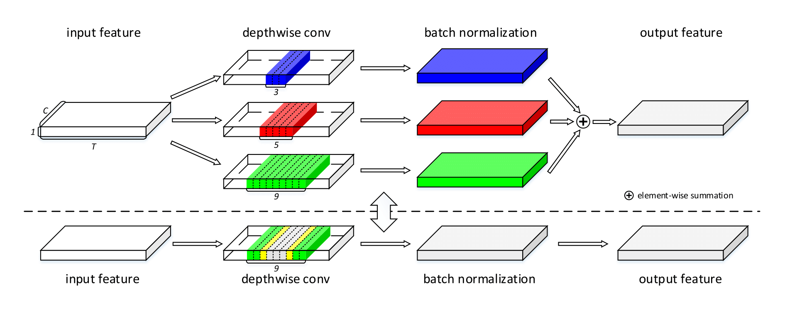

# Small-Footprint Keyword Spotting with Multi-Scale Temporal Convolution

<p align="center">
  
</p>

Tensorflow implementation of ["Small-Footprint Keyword Spotting with Multi-Scale Temporal Convolution"](https://arxiv.org/abs/2010.09960) (INTERSPEECH 2020).

## Abstract

Keyword Spotting (KWS) plays a vital role in human-computer interaction for smart on-device terminals and service robots. It remains challenging to achieve the trade-off between small footprint and high accuracy for KWS task. 
In this paper, we explore the application of multi-scale temporal modeling to the small-footprint keyword spotting task.
We propose a multi-branch temporal convolution module (MTConv), a CNN block consisting of multiple temporal convolution filters with different kernel sizes, which enriches temporal feature space. Besides, taking advantage of temporal and depthwise convolution, a temporal efficient neural network (TENet) is designed for KWS system. Based on the purposed model, we replace standard temporal convolution layers with MTConvs that can be trained for better performance. While at the inference stage, the MTConv can be equivalently converted to the base convolution architecture, so that no extra parameters and computational costs are added compared to the base model. The results on Google Speech Command Dataset show that one of our models trained with MTConv performs the accuracy of 96.8\% with only 100K parameters.

## Requirements

- `tensorflow==1.15.0`

- `pandas`

## Run experiments

Train base TENet12 on Google Speech Commands Dataset v0.01:
```
python -m main --dataset_path ${DATASET_PATH} --arch TENet12Model --save_folder ${SAVE_PATH}
```

Evaluate the model on testing set:
```
python -m main --mod eval --dataset_path ${DATASET_PATH} --dataset_name test --arch TENet12Model \
--checkpoint_path ${SAVE_PATH}/TENet12Model-30000
```

Train TENet12 with MTConvs:
```
python -m main --dataset_path ${DATASET_PATH} --arch TENet12Model --kernel_list 3,5,7,9 --save_folder ${SAVE_PATH}
```

Convert TENet12 with MTConvs to base TENet12 and evaluate the converted model:
```
python -m tenet_fusion --arch TENet12Model --kernel_list 3,5,7,9 \
--save_folder ${SAVE_PATH} --checkpoint_path ${TENet12_MTConvs_CHECKPOINT_PATH}

python -m main --dataset_path ${DATASET_PATH} --mod eval --dataset_name test \
--arch TENet12Model --checkpoint_path ${SAVE_PATH}/TENet12Model-30000
```

## Citation
If you find our work useful for your research, please consider citing the paper:
```
@misc{li2020smallfootprint,
      title={Small-Footprint Keyword Spotting with Multi-Scale Temporal Convolution}, 
      author={Ximin Li and Xiaodong Wei and Xiaowei Qin},
      year={2020},
      eprint={2010.09960},
      archivePrefix={arXiv},
      primaryClass={eess.AS}
}
```
## Reference
The implementation of TC-ResNet: https://github.com/hyperconnect/TC-ResNet.
